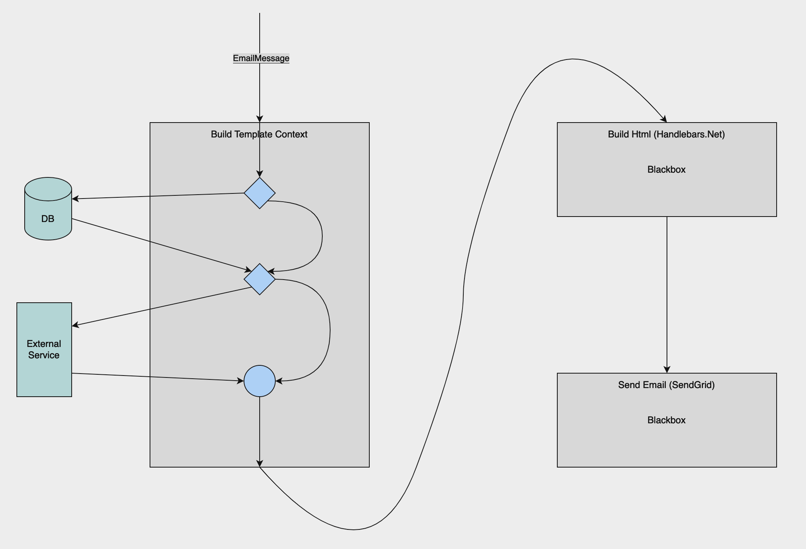
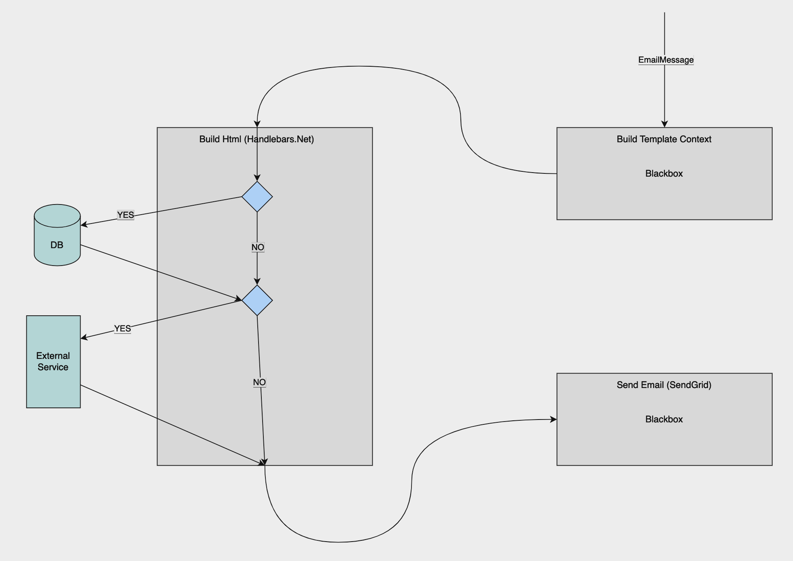
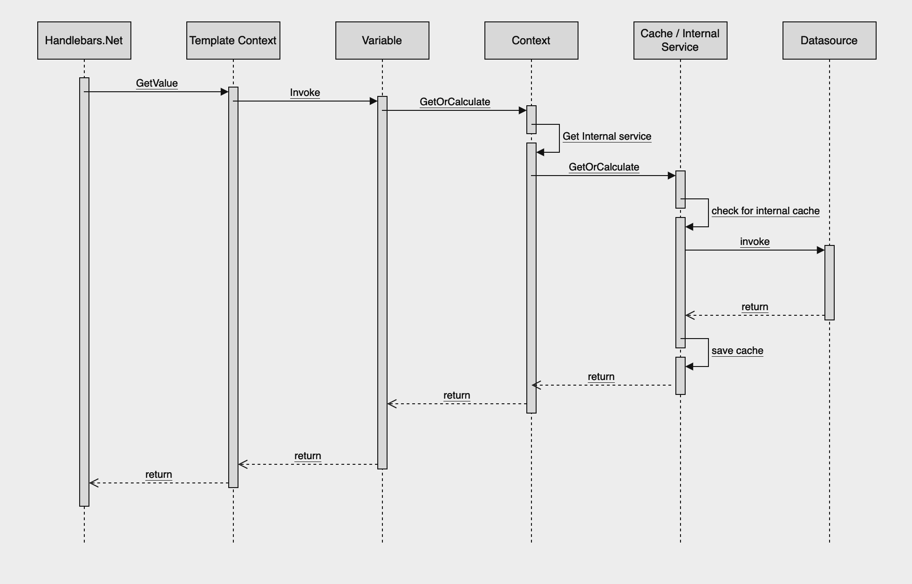

## Actual Status
Currently, before starting the generation of mail content (HTML), the system generates as many properties as possible. The conditions for generating these are based on the existence of another property, sometimes from the original message, other times from properties that were previously obtained. 

The main drawback of this approach is that the system ends up invoking more services than necessary (on average), because it is preferred that there be excess properties and not missing ones.



Example of code in the system
```
if (PropertyA is not null) {
    // get data from service or database
}
```

## Proposal
Instead of loading as many properties as possible, Handlebars could indicate which properties it requires in the template, allowing the system to execute only the service(s) that are required to obtain that property, especially from external services.

To achieve this, instead of building a context, for template generation, with properties, it is possible to build a context with functions that allow you to determine when a property is required and act accordingly.



A context is generated with all the available variables, when required the variables will invoke a function to determine the origin of the information, first verifying if the value already exists in a local cache for the execution of the template, if it does not exist, The required functionality would be invoked to obtain the "value of the variable".



## Advantages
- Invoke only required services.
- Hability to generate an exception when a variable is undefined (most cases)
- Have the possibility of knowing which variables are used in each template

## Disadvantages
- Execution of at least 2 function instead of get the value directly
